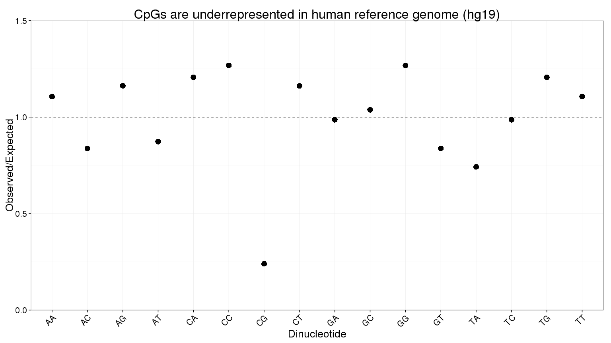
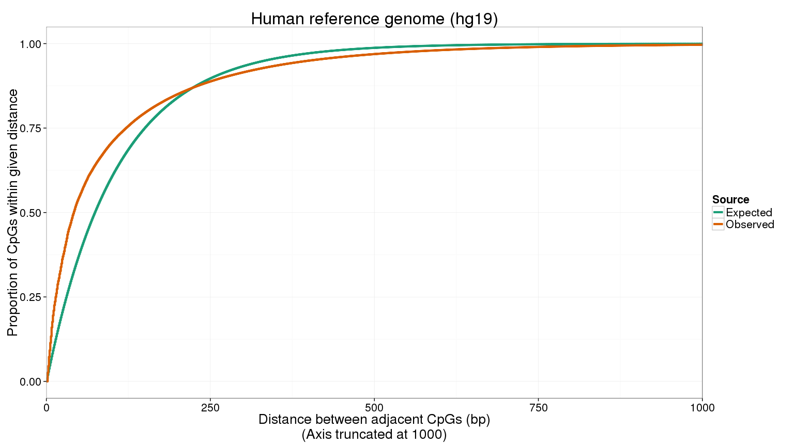
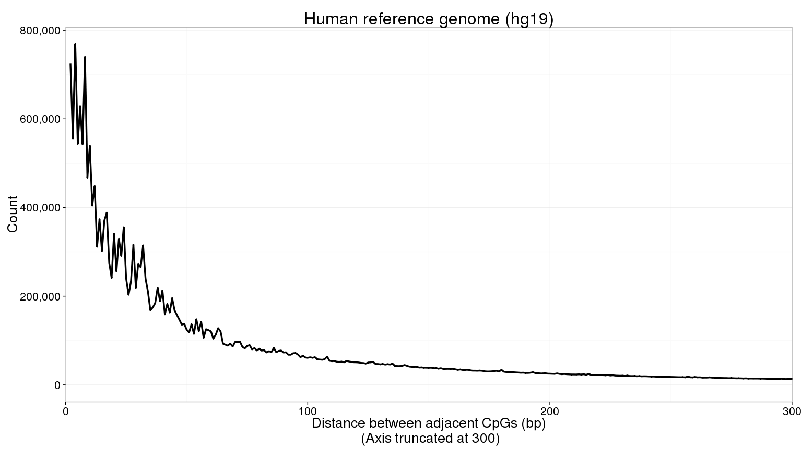

# Supplementary material for Biology Background
Peter Hickey  
Modified: 22 April 2015. Compiled: `r format(Sys.Date(), '%d %b %Y')`  


# CpGs are underrepresented in the human genome (hg19)

Firstly, the frequency of each nucleotide is computed. Secondly, the expected frequency of each dinucleotide is computed under the _independence model_. Under the independence model, the frequency of each dinucleotide is simply the product of the respective observed nucleotide frequencies. Finally, these expected frequencies are compared to the observed values from the respective reference genomes.

I only use the autosomes, sex chromosomes and mitochondrial chromosome in all analyses, that is, I do not consider the "random", "unplaced" and "alternate haplotype" contigs in the reference genomes.

All results are computed at the chromosome-level as well as being summarised genome-wide.

## Compute the nucleotide and dinucleotide frequencies


```r
library(BSgenome.Hsapiens.UCSC.hg19)
#> Loading required package: BSgenome
#> Loading required package: BiocGenerics
#> Loading required package: parallel
#> 
#> Attaching package: 'BiocGenerics'
#> 
#> The following objects are masked from 'package:parallel':
#> 
#>     clusterApply, clusterApplyLB, clusterCall, clusterEvalQ,
#>     clusterExport, clusterMap, parApply, parCapply, parLapply,
#>     parLapplyLB, parRapply, parSapply, parSapplyLB
#> 
#> The following object is masked from 'package:stats':
#> 
#>     xtabs
#> 
#> The following objects are masked from 'package:base':
#> 
#>     Filter, Find, Map, Position, Reduce, anyDuplicated, append,
#>     as.data.frame, as.vector, cbind, colnames, do.call,
#>     duplicated, eval, evalq, get, intersect, is.unsorted, lapply,
#>     mapply, match, mget, order, paste, pmax, pmax.int, pmin,
#>     pmin.int, rank, rbind, rep.int, rownames, sapply, setdiff,
#>     sort, table, tapply, union, unique, unlist, unsplit
#> 
#> Loading required package: S4Vectors
#> Loading required package: stats4
#> Loading required package: IRanges
#> Loading required package: GenomeInfoDb
#> Loading required package: GenomicRanges
#> Loading required package: Biostrings
#> Loading required package: XVector
#> Loading required package: rtracklayer
library(knitr)
# Nucleotide frequencies
nf <- bsapply(new("BSParams", X = Hsapiens, FUN = letterFrequency,
                  exclude = c("rand", "Un", "hap"), simplify = TRUE),
              letters = c("A", "C", "G", "T"))
# Pretty print the results
kable(data.frame(percentage = round(100 * rowSums(nf) /
                                      sum(as.numeric(nf)), 1)))
```

      percentage
---  -----------
A           29.5
C           20.4
G           20.5
T           29.6

```r

# GC-percentage
round(100 * sum(nf[c("C", "G"), ]) / sum(as.numeric(nf)), 1)
#> [1] 40.9

# Dinucleotide frequencies
df <- bsapply(new("BSParams", X = Hsapiens, FUN = dinucleotideFrequency,
                  exclude = c("rand", "Un", "hap"), simplify = TRUE))
# Pretty print the results
kable(data.frame(percentage = round(100 * rowSums(df) /
                                      sum(as.numeric(df)), 1)))
```

      percentage
---  -----------
AA           9.8
AC           5.0
AG           7.0
AT           7.7
CA           7.3
CC           5.2
CG           1.0
CT           7.0
GA           5.9
GC           4.3
GG           5.2
GT           5.0
TA           6.6
TC           5.9
TG           7.3
TT           9.8

```r

# CpG percentage
round(100 * rowSums(df) / sum(as.numeric(df)), 1)["CG"]
#> CG 
#>  1
```

## Plot the observed:expected ratio for each dinucleotide


```r
library(ggplot2)
thesis_theme <- theme_classic(base_size = 20)
thesis_theme <- theme_bw(base_size = 20)
edf <- nf %*% t(nf) / (sum(nf %*% t(nf))) * 100
x <- data.frame(Dinucleotide = names(rowSums(df)),
                Observed = as.vector(100 * rowSums(df) / sum(as.numeric(df))),
                Expected = as.vector(edf))
g <- ggplot(x, aes(x = Dinucleotide, y = Observed / Expected)) +
  geom_point(size = 5) + coord_cartesian(ylim = c(0, 1.5)) +
  ggtitle("CpGs are underrepresented in human reference genome (hg19)") +
  thesis_theme +
  theme(axis.text.x = element_text(angle = 45, hjust = 1)) +
  geom_hline(yintercept = 1, linetype = 2)
g
```

 

```r
g
```

 

```r
ggsave("dinucleotide_frequency_hg19.pdf", g, height = 9, width = 16)
```

## Frequency of CpGs on each chromosome in the human reference genome (hg19)

Chromosome 19 has the highest CpG density of the autosomes in the human reference genome (hg19):

```r
cpg_density <- data.frame(Chromosome = colnames(df), 
                          Percentage = df['CG', ] / colSums(df) * 100)
knitr::kable(cpg_density, align = "c")
```

         Chromosome    Percentage 
------  ------------  ------------
chr1        chr1       1.0140554  
chr2        chr2       0.9086038  
chr3        chr3       0.8335061  
chr4        chr4       0.7854188  
chr5        chr5       0.8477739  
chr6        chr6       0.8814890  
chr7        chr7       1.0097388  
chr8        chr8       0.9161907  
chr9        chr9       1.0211307  
chr10      chr10       1.0290477  
chr11      chr11       0.9837504  
chr12      chr12       0.9788508  
chr13      chr13       0.8407878  
chr14      chr14       0.9738175  
chr15      chr15       1.0691800  
chr16      chr16       1.3916201  
chr17      chr17       1.4854387  
chr18      chr18       0.9070979  
chr19      chr19       1.8946342  
chr20      chr20       1.2061437  
chr21      chr21       1.0836815  
chr22      chr22       1.6566984  
chrX        chrX       0.8248819  
chrY        chrY       0.8494185  
chrM        chrM       2.6493663  

```r
write.table(cpg_density, "CpG_density_hg19.txt", col.names = TRUE, 
            row.names = FALSE, quote = FALSE)
```

# Distances between CpGs in the human reference genome (hg19)

I extract the co-ordinates of all CpGs in the human reference genome (hg19) and compute the intra-pair distances (IPD) between adjacent CpGs. I then plot the empirical cumulative distribution function of IPD. These are compared to the distances we would expect if CpGs were uniformly distributed across the genome.

I only use the autosomes, sex chromosomes and mitochondrial chromosome in all analyses, that is, I do not consider the "random", "unplaced" and "alternate haplotype" contigs in the reference genomes.


```r
set.seed(666)

# Observed IPDs
cpgs <- bsapply(new("BSParams", X = Hsapiens, FUN = matchPattern,
                    exclude = c("rand", "Un", "hap"), simplify = TRUE),
                pattern = "CG")
d <- unlist(lapply(cpgs, start), use.names = FALSE)
ipd <- diff(d)
# Drop negative distances, which correspond to CpGs on different chromosomes
ipd <- ipd[ipd > 0]

# Expected IPDs if CpGs were uniformly distributed on genome
d_sim <- bsapply(new("BSParams", X = Hsapiens, FUN = function(x) {
  cpg_freq <- countPattern("CG", x)
  sort(sample(x = length(x), size = cpg_freq, replace = FALSE))
  }, exclude = c("rand", "Un", "hap"), simplify = TRUE))
ipd_sim <- diff(unlist(d_sim, use.names = FALSE))
# Drop negative distances, which correspond to CpGs on different chromosomes
ipd_sim <- ipd_sim[ipd_sim > 0]

# Drop negative values, which are due to CpGs being on different chromosomes
ipd_df <- data.frame(IPD = c(ipd, ipd_sim),
                     Source = c(rep("Observed", length(ipd)),
                                rep("Expected", length(ipd_sim))))
```

## Empirical cumulative distribution plot


```r
library(RColorBrewer)
thesis_theme <- theme_classic(base_size = 20)
thesis_theme <- theme_bw(base_size = 20)

g <- ggplot(aes(x = IPD, colour = Source), data = ipd_df) + 
  stat_ecdf(size = 1.5) + 
  thesis_theme +
  coord_cartesian(xlim = c(0, 1000)) +
  xlab("Distance between adjacent CpGs (bp)\n(Axis truncated at 1000)") +
  ggtitle("Human reference genome (hg19)") + 
  scale_color_brewer(palette = "Dark2") + 
  ylab("Proportion of CpGs within given distance")
g
```

 

```r
ggsave("IPD_ECDF_hg19.pdf", g, width = 16, height = 9)
```

## Frequency polygon


```r
library(scales)

ipd_table <- table(ipd)
ipd_sim_table <- table(ipd_sim)
ipd_table_df <- data.frame(IPD = c(as.numeric(names(ipd_table)),
                                   as.numeric(names(ipd_sim_table))),
                           Count = c(ipd_table, ipd_sim_table),
                           Source = c(rep("Observed", length(ipd_table)),
                                      rep("Expected", length(ipd_sim_table))))

g <- ggplot(aes(x = IPD, y = Count),
            data = subset(ipd_table_df, Source == "Observed")) +
  geom_line(size = 1.2) + coord_cartesian(xlim = c(0, 300)) +
  xlab("Distance between adjacent CpGs (bp)\n (Axis truncated at 300)") +
  ggtitle("Human reference genome (hg19)") +
  scale_y_continuous(labels = comma) +
  thesis_theme
g
```

 

```r
ggsave("IPD_frequency_polygon_hg19.pdf", g, width = 16, height = 9)
```

# Many reads do not contain CpGs

I use the _Lister_ dataset to show that many reads from a whole-genome bisulfite-sequencing experiment do not contain any CpGs.


```r
sample_names <- c("ADS", "ADS-adipose", "ADS-iPSC", "FF", "FF-iPSC_19.11", 
                  "FF-iPSC_19.11+BMP4", "FF-iPSC_19.7", "FF-iPSC_6.9", 
                  "H1+BMP4", "H1_r1", "H1_r2", "H9", "H9_Laurent", "HSF1", 
                  "IMR90-iPSC", "IMR90_r1", "IMR90_r2")
y <- lapply(sample_names, function(sn) {
  fn <- paste0("../../Lister/", sn, "/1_tuples/hist/DM_", sn, 
               ".CG_per_read.hist")
  x <- read.table(fn, header = TRUE, as.is = TRUE)
  x[x$n == 0, "count"] / sum(as.numeric(x$count))
})
y <- data.frame("Sample" = sample_names,
                "Percentage" = round(100 * 
                                                   unlist(y, use.names = FALSE),
                                                 0)
                )
colnames(y) <- c("Sample", "Reads with no CpGs (%)")
write.table(y, "Lister_reads_with_no_CpGs.txt", quote = FALSE, 
            row.names = FALSE, col.names = TRUE, sep = "\t")
knitr::kable(y, align = "c")
```

       Sample          Reads with no CpGs (%) 
--------------------  ------------------------
        ADS                      39           
    ADS-adipose                  37           
      ADS-iPSC                   35           
         FF                      53           
   FF-iPSC_19.11                 48           
 FF-iPSC_19.11+BMP4              52           
    FF-iPSC_19.7                 49           
    FF-iPSC_6.9                  50           
      H1+BMP4                    49           
       H1_r1                     62           
       H1_r2                     59           
         H9                      51           
     H9_Laurent                  39           
        HSF1                     72           
     IMR90-iPSC                  50           
      IMR90_r1                   58           
      IMR90_r2                   57           

# Session info


```r
library(devtools)
session_info()
#> Session info --------------------------------------------------------------
#>  setting  value                       
#>  version  R version 3.1.1 (2014-07-10)
#>  system   x86_64, linux-gnu           
#>  ui       X11                         
#>  language (EN)                        
#>  collate  C                           
#>  tz       <NA>
#> Packages ------------------------------------------------------------------
#>  package                     * version  date       source        
#>  BBmisc                      * 1.8      2014-10-30 CRAN (R 3.1.1)
#>  BSgenome                      1.34.1   2015-02-09 Bioconductor  
#>  BSgenome.Hsapiens.UCSC.hg19   1.4.0    2014-10-16 Bioconductor  
#>  BatchJobs                   * 1.5      2014-10-30 CRAN (R 3.1.1)
#>  BiocGenerics                  0.12.1   2015-02-09 Bioconductor  
#>  BiocParallel                * 1.0.0    2014-10-15 Bioconductor  
#>  Biostrings                    2.34.1   2015-02-09 Bioconductor  
#>  DBI                         * 0.3.1    2014-09-24 CRAN (R 3.1.1)
#>  GenomeInfoDb                  1.2.4    2015-02-09 Bioconductor  
#>  GenomicAlignments           * 1.2.1    2014-11-04 Bioconductor  
#>  GenomicRanges                 1.18.4   2015-02-17 Bioconductor  
#>  IRanges                       2.0.1    2015-02-09 Bioconductor  
#>  MASS                        * 7.3-35   2014-09-30 CRAN (R 3.1.1)
#>  RColorBrewer                  1.0-5    2011-06-17 CRAN (R 3.1.1)
#>  RCurl                       * 1.95-4.3 2014-07-29 CRAN (R 3.1.1)
#>  RSQLite                     * 1.0.0    2014-10-25 CRAN (R 3.1.1)
#>  Rcpp                        * 0.11.3   2014-09-29 CRAN (R 3.1.1)
#>  Rsamtools                   * 1.18.2   2015-02-09 Bioconductor  
#>  S4Vectors                     0.4.0    2014-10-21 Bioconductor  
#>  XML                         * 3.98-1.1 2013-06-20 CRAN (R 3.1.1)
#>  XVector                       0.6.0    2014-10-21 Bioconductor  
#>  base64enc                   * 0.1-2    2014-06-26 CRAN (R 3.1.1)
#>  bitops                      * 1.0-6    2013-08-17 CRAN (R 3.1.1)
#>  brew                        * 1.0-6    2011-04-13 CRAN (R 3.1.1)
#>  checkmate                   * 1.5.0    2014-10-19 CRAN (R 3.1.1)
#>  codetools                   * 0.2-9    2014-08-21 CRAN (R 3.1.1)
#>  colorspace                  * 1.2-4    2013-09-30 CRAN (R 3.1.1)
#>  devtools                      1.7.0    2015-01-17 CRAN (R 3.1.1)
#>  digest                      * 0.6.4    2013-12-03 CRAN (R 3.1.1)
#>  evaluate                    * 0.5.5    2014-04-29 CRAN (R 3.1.1)
#>  fail                        * 1.2      2013-09-19 CRAN (R 3.1.1)
#>  foreach                     * 1.4.2    2014-04-11 CRAN (R 3.1.1)
#>  formatR                     * 1.0      2014-08-25 CRAN (R 3.1.0)
#>  ggplot2                       1.0.0    2014-05-21 CRAN (R 3.1.1)
#>  gtable                      * 0.1.2    2012-12-05 CRAN (R 3.1.1)
#>  htmltools                   * 0.2.6    2014-09-08 CRAN (R 3.1.1)
#>  iterators                   * 1.0.7    2014-04-11 CRAN (R 3.1.1)
#>  knitr                         1.9      2015-01-20 CRAN (R 3.1.1)
#>  labeling                    * 0.3      2014-08-23 CRAN (R 3.1.1)
#>  munsell                     * 0.4.2    2013-07-11 CRAN (R 3.1.1)
#>  plyr                        * 1.8.1    2014-02-26 CRAN (R 3.1.1)
#>  proto                       * 0.3-10   2012-12-22 CRAN (R 3.1.1)
#>  reshape2                    * 1.4      2014-04-23 CRAN (R 3.1.1)
#>  rmarkdown                   * 0.5.1    2015-01-26 CRAN (R 3.1.1)
#>  rstudioapi                  * 0.2      2014-12-31 CRAN (R 3.1.1)
#>  rtracklayer                   1.26.2   2015-02-09 Bioconductor  
#>  scales                        0.2.4    2014-04-22 CRAN (R 3.1.1)
#>  sendmailR                   * 1.2-1    2014-09-21 CRAN (R 3.1.1)
#>  stringr                     * 0.6.2    2012-12-06 CRAN (R 3.1.1)
#>  yaml                        * 2.1.13   2014-06-12 CRAN (R 3.1.2)
#>  zlibbioc                    * 1.12.0   2014-10-15 Bioconductor
```

